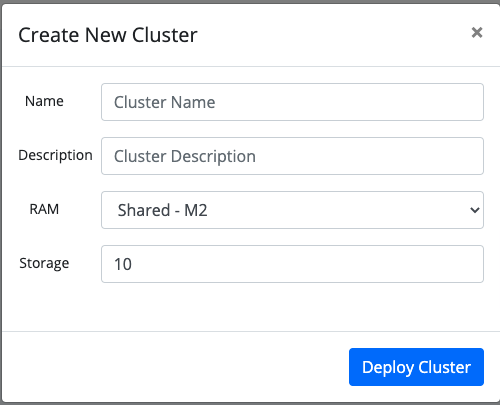
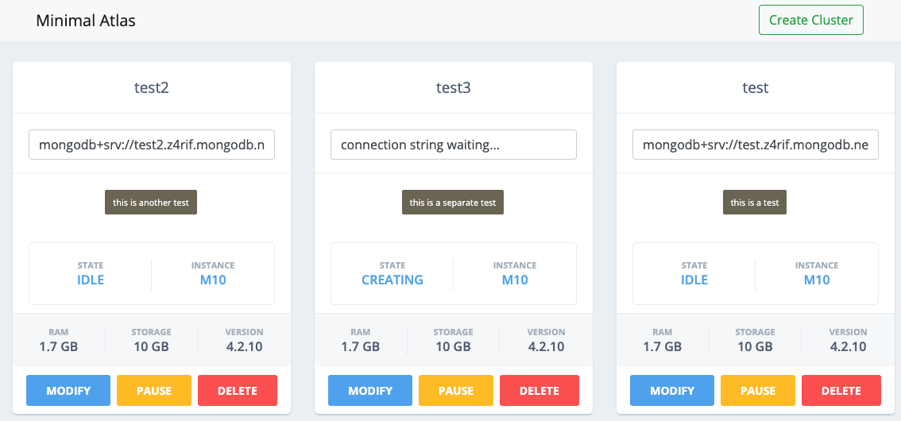

# minimal-atlas
Minimalistic Atlas UI to grant developers the ability to quickly deploy an Atlas cluster while shielding them from the full power of the standard Atlas UI.

## first, create a cluster using the create cluster button

## then, copy the connection string, modify it, pause, etc.

